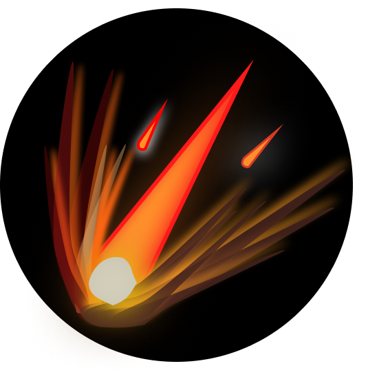

# A space Project

## A website about space.

## logo of the website(might change later)
|  |
|:--:| 
| *Space* |

## Background Image
| |
|:--:|
|*Credits:<a href="http://www.freepik.com">Designed by vectorpouch / Freepik</a>*|

## Custom Assets

### 1)Mercury

||
|:--:|
|*These were inspired from <a href="https://www.youtube.com/c/inanutshell">Kurzgesagt</a>*|

### 2)Earth
||
|:--:|
|*Earth*|

### 3)Venus
||
|:--:|
|*Venus*|

### 4)Mars
||
|:--:|
|*Mars(This is genuine mistake on my side, I made mars smaller than mercury whereas it is the other way around lol)*|

